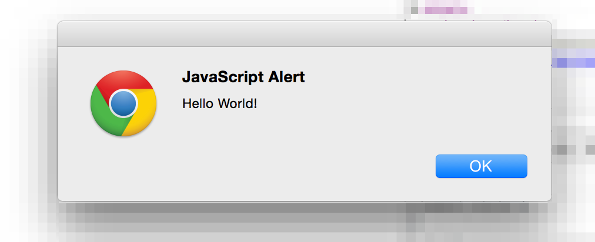

# Get your hands on Webpack

You can write a _ReactJS_ app using good ol' _ES5_ syntax and few _polyfills_.
You can just dump files in your browser and load the page to see your _HelloWorld_ working. But this is not going to work, not in the long run.

> _ReactJS_ is a library **designed to build rich applications**, unlike
> _jQuery_ in not meant to enrich an existing web page with some plugins.

In this chapter we'll go a bit further and you are going to use [Webpack](http://webpack.github.io/) to build your application's _bundle_ from some well structured Javascript source files. This is called **transpiling** and I can give you some damn good arguments why you want do that:

- each of your source files will be small therefore **extremely easy to read**
- you can **use edge language features** that are not yet available to the browsers (like arrow functions and Promises)
- you can structure your app with different folders and meaningful naming conventions so to **reduce the needs for documentation**

## Install Webpack

_Webpack_ is available through _NPM_ and it provides a quite easy to use command line tool that will make a breeze to _transpile_ a basic application.

	npm install -g webpack

[Click here for the official documentation »](http://webpack.github.io/docs/installation.html)

## Setup a new project!​

Here I really want to skip the basics. Let's take an easy example that already leverages NodeJS' modularity to write a structured Javascript application. Of course the outcome will be an HelloWorld app!

So let's start building some basic files!

> This is a very basic lesson so we'll spend quite a lot of efforts explaining
> which role each file plays within the application structure. Later of our app
> will grow in number of files and we'll introduce few more specific roles, still
> **the following roles are the most important concepts** you must understand 
> very deeply

### index.html

This is the **HTML entry point** of our App.

	<!DOCTYPE html>
	<html>
	<head>
	  <title>TodoApp</title>
	</head>
	<body>
	  <h1>Hello World</h1>
      
	</body>
	</html>

### src/index.js

This is the **Javascript entry point** of our App.  
In this file we write all the initialization instructions and we **require external modules** to delegate complex logic.

	var greet = require('./greet');
	greet('ReactJS');
	
> The `require()` function comes from _NodeJS_ and allows to **split a big 
> application into simple modules**. Today's browsers don't understand it 
> (they will) and that's why we need tools like _Webpack_ (or _Browserify_) 
> to **generate a browser-executable Javascript file** from our source code.

### src/greet.js

This is a **Javascript module** and plays a foundamental role in your application architecture. A module is just a library of functions that are exposed via `module.exports` or `export.methodName` symbols.

Our simple module will expose a single function that is used by the _Javascript entry point_ to greet the user. There is not much logic involved but the point is well proven.

	module.exports = function(str) {
      alert(['Hello ', str, '!'].join(''));
	};

### Build Time!

You may hace noticed that in out `index.html` we refer to `build/index.js` which we haven't created. Well, that's because _Webpack_ will generate this file using `src/index.js` as **entry point** for our **app's bundle**:

	webpack src/index.js build/index.js

## Now it's your turn!

> Try to add some more modules to your application. 

Remember those simple principles:

* a module can require other modules
* a module can export more than one method
* a module can export every type (strings, numbers, ...)

	

